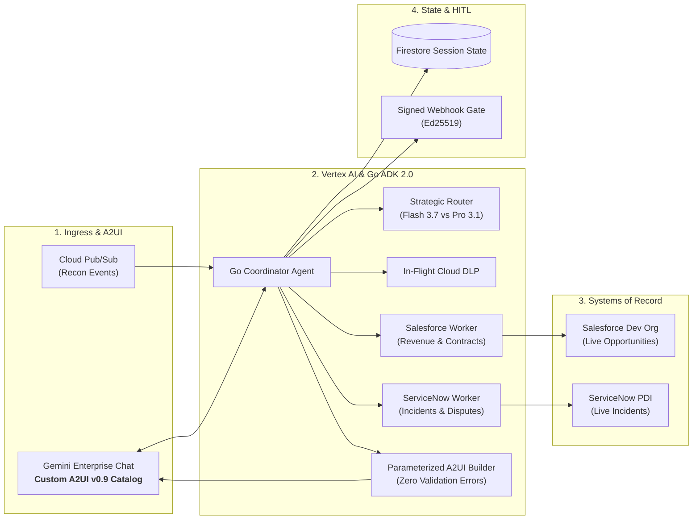

# Enterprise Data Reconciliation Agent Ecosystem

[](https://go.dev/)
[](https://cloud.google.com/vertex-ai)
[](docs/a2ui_custom_catalog.md)
[](docs/code_review_matrix.md)

An autonomous, enterprise-grade multi-agent data reconciliation platform built in **Go (ADK 2.0)** and hosted on **Google Cloud Platform (GCP)** via **Vertex AI Agent Engine** and **Cloud Run (BYO-MCP)**.

---

## 🌟 Executive Overview

Cross-system discrepancies between **Salesforce** (CRM, Revenue Cloud, Commercial Contract Caps) and **ServiceNow** (ITSM, Service Outage Incidents, SLA Dispute Credits) cost enterprises thousands of operational hours. The **Data Reconciliation Agent** solves this through:

1. **High-Performance Go Runtime (ADK 2.0)**: Sub-second concurrent sub-agent execution, asynchronous long-term memory via channels, and strict struct-tag JSON schema compilation.
2. **Strategic Model Routing**: Dynamic routing between **Gemini 3.7 Flash Preview** (sub-450ms lookups) and **Gemini 3.1 Pro** (complex multi-way reconciliation).
3. **Custom A2UI v0.9 Visual Catalog**: Replaces generic chatbot widgets with branded, interactive **Explosive Variance Badges**, **Side-by-Side Diff Tables**, **Interactive Action Selectors**, and **HITL Signed Mutation Cards**.
4. **Enterprise Security & Privacy**: In-flight PII redaction via **Cloud Sensitive Data Protection (DLP)**, Single-Region **Cloud KMS CMEK**, **Application Default Credentials (ADC)**, and cryptographically signed webhooks for write mutations.

---

## 🏛️ System Architecture



---

## ⚡ Quickstart & Makefile Automation

The root [`Makefile`](Makefile) provides simple commands for the entire lifecycle:

```bash
# 1. Inspect or configure sandbox credentials (Salesforce & ServiceNow)
make setup-env

# 2. Generate 500 correlated enterprise records (4 variance archetypes)
make synth COUNT=500

# 3. Simulate or load records into live Salesforce and ServiceNow sandboxes
make seed-dry-run            # Simulation mode (no API calls)
make seed-sample LIMIT=5     # Seed a 5-record test batch
make seed                    # Seed all 500 records (interactive prompts if keys missing)

# 4. Programmatically verify live records in both platforms
make verify

# 5. Run the Go Reconciliation Agent & stream A2UI v0.9 cards
make run-agent CONTRACT=CTR-2026-001

# 6. Deploy to Vertex AI Agent Engine & Gemini Enterprise Gateway
make deploy                  # Deploy Go ADK 2.0 runtime to Agent Engine
make gateway-setup           # Provision Agent Gateway & Agent Registry (IaC)
make register-agent          # Connect & enable agent in Gemini Enterprise Gateway
make gateway-status          # Validate live bindings and registered endpoints

# 7. Run test suites and compile binaries
make test                    # Run package tests & golden evaluation benchmarks
make build                   # Compile bin/synth, bin/loader, bin/verifier, bin/agent
```

---

## 📚 Complete Project Documentation

All architectural design documents, runbooks, specifications, and scorecards are available in the [`docs/`](docs/) directory:

- 🚀 **[CI/CD, Linting & Pre-Commit Guide](docs/ci_cd_and_linting_guide.md)** — GolangCI-Lint configuration, pre-commit hooks, and GitHub Actions / Cloud Build pipelines.
- 🛡️ **[Agent Gateway & Agent Registry IaC](docs/agent_gateway_iac.md)** — Declarative Agent Gateway (Ingress/Egress), Service Extensions, IAP policies, and Agent Registry.
- 🏛️ **[System Architecture & RFC/TDD](docs/architecture.md)** — Detailed C4 container diagrams, sequence flows, and system boundaries.
- 🎯 **[Critical User Journeys (CUJs) & Scenario Catalog](docs/critical_user_journeys.md)** — 5 real enterprise scenarios for *Apex Global Cloud Services*, personas, natural language prompts, and A2UI results.
- 🤖 **[Gemini Enterprise Integration Guide](docs/gemini_enterprise_integration.md)** — Extension manifests, OpenAPI 3.0 tool schemas, OIDC authentication, and streaming A2UI custom catalog rendering.
- 📊 **[Draw.io Visual Architecture Diagram](docs/architecture.drawio)** — Visual diagram openable in Draw.io / diagrams.net.
- 📐 **[Component Blueprint & Code Contracts](docs/blueprint.md)** — Go interfaces, schemas, error recovery models, and async memory.
- 🎨 **[A2UI Custom Component Catalog](docs/a2ui_custom_catalog.md)** — Specification for custom explosive badges, diff matrices, and Figma design tokens.
- 🖌️ **[Figma Design Spec & Asset Guide](docs/figma_design_spec.md)** — Collaborative design specifications, vector layer hierarchies, and starter SVGs.
- 🌱 **[Synthetic Data Seeding & Live Systems Guide](docs/synthetic_data_seeding_guide.md)** — 500-sample correlated generation and live seeding into Salesforce and ServiceNow Developer Sandboxes.
- 🛠️ **[ADK & MCP Tools Reference Manual](docs/tools_reference.md)** — Comprehensive catalog of Pub/Sub, connector, DLP, and HITL tool schemas.
- ⚙️ **[Operations & Day-2 Support Runbook](docs/operations_runbook.md)** — SRE guide for DLQ triage, secret rotation, and connector incident handling.
- 🧪 **[Evaluation & Golden Benchmark Guide](docs/evaluation_benchmark.md)** — 500-sample synthetic dataset, 4 variance archetypes, and LLM-as-a-judge scoring.
- 🚀 **[Complete Deployment Runbook](docs/deployment_guide.md)** — Step-by-step Terraform deployment and GCP configuration guide.
- 💯 **[95/95 AgentOps Code Review Matrix](docs/code_review_matrix.md)** — Exhaustive compliance scorecard showing code evidence across all 19 review criteria.
- 📋 **[23-Task Technical Backlog](docs/backlog_task_breakdown.md)** — Master task status matrix and delivery phases.
- ⚖️ **[Architecture Decision Records (ADRs)](docs/adr/)** — Formal ADR registry (ADR-0001 through ADR-0009).
- 📰 **[Technical Blog Post](docs/blog_post.md)** — 5 Days of AI Agents engineering journey and custom A2UI showcase.

---

## 👥 Authors & Team
- **Affiliation**: Google Cloud GTM (Go-To-Market) & AI Systems Architecture
- **Repository**: [github.com/tiaaburton/Data-Recon-Agent](https://github.com/tiaaburton/Data-Recon-Agent)
