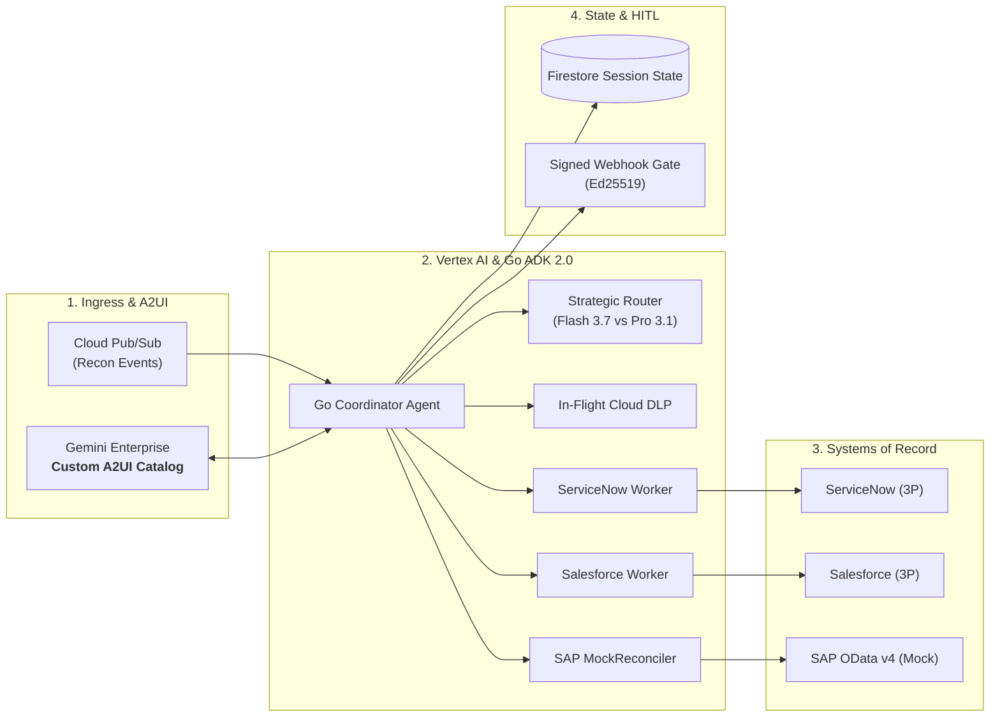

# Enterprise Data Reconciliation Agent Ecosystem

[](https://go.dev/)
[](https://cloud.google.com/vertex-ai)
[](docs/a2ui_custom_catalog.md)
[](docs/code_review_matrix.md)

An autonomous, enterprise-grade multi-agent data reconciliation platform built in **Go (ADK 2.0)** and hosted on **Google Cloud Platform (GCP)** via **Vertex AI Agent Engine** and **Cloud Run (BYO-MCP)**.

---

## 🌟 Executive Overview

Cross-system discrepancies between **ServiceNow** (ITSM/tickets), **Salesforce** (CRM/contracts), and **SAP S/4HANA** (ERP/billing) cost enterprises thousands of operational hours. The **Data Reconciliation Agent** solves this through:

1. **High-Performance Go Runtime (ADK 2.0)**: Sub-second concurrent sub-agent execution, asynchronous long-term memory via channels, and strict struct-tag JSON schema compilation.
2. **Strategic Model Routing**: Dynamic routing between **Gemini 3.7 Flash Preview** (sub-450ms lookups) and **Gemini 3.1 Pro** (complex multi-way reconciliation).
3. **Custom A2UI v0.8 Visual Catalog**: Replaces generic chatbot widgets with branded, interactive **Explosive Variance Badges**, **Three-Way Diff Matrices**, and **HITL Signed Mutation Cards**.
4. **Enterprise Security & Privacy**: In-flight PII redaction via **Cloud Sensitive Data Protection (DLP)**, Single-Region **Cloud KMS CMEK**, and cryptographically signed webhooks for ERP write actions.

---

## 🏛️ System Architecture



---

## 📚 Complete Project Documentation

All architectural design documents, runbooks, specifications, and papers are available in the [`docs/`](docs/) directory:

- 🏛️ **[System Architecture & RFC/TDD](docs/architecture.md)** — Detailed C4 container diagrams, sequence flows, and system boundaries.
- 📊 **[Draw.io Visual Architecture Diagram](docs/architecture.drawio)** — Visual diagram openable in Draw.io / diagrams.net.
- 📐 **[Component Blueprint & Code Contracts](docs/blueprint.md)** — Go interfaces, schemas, error recovery models, and async memory.
- 🎨 **[A2UI Custom Component Catalog](docs/a2ui_custom_catalog.md)** — Specification for custom explosive badges, diff matrices, and Figma design tokens.
- 🖌️ **[Figma Design Spec & Asset Guide](docs/figma_design_spec.md)** — Collaborative design specifications, vector layer hierarchies, and starter SVGs.
- 🛠️ **[ADK & MCP Tools Reference Manual](docs/tools_reference.md)** — Comprehensive catalog of Pub/Sub, connector, DLP, and HITL tool schemas.
- ⚙️ **[Operations & Day-2 Support Runbook](docs/operations_runbook.md)** — SRE guide for DLQ triage, secret rotation, and connector incident handling.
- 🧪 **[Evaluation & Golden Benchmark Guide](docs/evaluation_benchmark.md)** — 500-sample synthetic dataset, 4 variance archetypes, and LLM-as-a-judge scoring.
- 🚀 **[Complete Redeployment Runbook](docs/deployment_guide.md)** — Step-by-step Terraform deployment and GCP configuration guide.
- 💯 **[95/95 AgentOps Code Review Matrix](docs/code_review_matrix.md)** — Exhaustive compliance scorecard showing code evidence across all 19 review criteria.
- 📋 **[23-Task Technical Backlog](docs/backlog_task_breakdown.md)** — Master task status matrix and delivery phases.
- ⚖️ **[Architecture Decision Records (ADRs)](docs/adr/)** — Formal ADR registry (ADR-0001 through ADR-0009).
- 📰 **[Technical Blog Post](docs/blog_post.md)** — 5 Days of AI Agents engineering journey and custom A2UI showcase.
- 📄 **[Research Paper](docs/research_paper.md)** — Academic/industry paper on declarative A2UI synthesis and A2A multi-agent consensus.

---

## ⚡ Quickstart

### 1. Generate Synthetic Data
```bash
go run cmd/synth/main.go --count=500 --output=tests/golden/discrepancies_golden.json
```

### 2. Run Automated Regression Suite
```bash
go test -v -race ./tests/...
```

### 3. Deploy Infrastructure via Terraform
```bash
cd terraform
terraform init
terraform apply
```

---

## 👥 Authors & Team
- **Affiliation**: Google Cloud GTM (Go-To-Market) & AI Systems Architecture
- **Repository**: [github.com/tiaaburton/Data-Recon-Agent](https://github.com/tiaaburton/Data-Recon-Agent)
