# Data Reconciliation Agent: Documentation Hub

Welcome to the comprehensive documentation suite for the **Enterprise Data Reconciliation Agent Ecosystem**.

This documentation is designed to enable engineers, cloud architects, and product designers to understand, extend, and redeploy this system from scratch.

---

## Documentation Navigation Matrix

```mermaid
graph TD
    Hub["📚 Documentation Hub (docs/README.md)"]
    
    Arch["🏛️ Architecture & TDD<br/>(docs/architecture.md)"]
    DrawIO["📊 Visual Draw.io Diagram<br/>(docs/architecture.drawio)"]
    Blueprint["📐 Component Blueprint<br/>(docs/blueprint.md)"]
    Deploy["🚀 Redeployment Runbook<br/>(docs/deployment_guide.md)"]
    A2UI["🎨 Custom A2UI Catalog<br/>(docs/a2ui_custom_catalog.md)"]
    Scorecard["💯 95/95 Review Matrix<br/>(docs/code_review_matrix.md)"]
    Backlog["📋 23-Task Breakdown<br/>(docs/backlog_task_breakdown.md)"]
    Blog["📰 Technical Blog Post<br/>(docs/blog_post.md)"]
    Paper["📄 Research Paper<br/>(docs/research_paper.md)"]
    ADR["⚖️ Architecture Decisions<br/>(docs/adr/)"]

    Hub --> Arch
    Hub --> DrawIO
    Hub --> Blueprint
    Hub --> Deploy
    Hub --> A2UI
    Hub --> Scorecard
    Hub --> Backlog
    Hub --> Blog
    Hub --> Paper
    Hub --> ADR
```

---

## Document Directory & Reading Guides

### 1. Architecture & Design
- **[System Architecture & RFC/TDD](architecture.md)**: Full Technical Design Document covering system topology, C4 container diagram, sequence flows, NFRs, Go ADK 2.0 multi-agent patterns, and GCP service boundaries.
- **[Draw.io Visual Architecture Diagram](architecture.drawio)**: Openable in diagrams.net / Draw.io, containing pixel-perfect GCP service cards and themed containers.
- **[Component Blueprint & Code Contracts](blueprint.md)**: Go structs, JSON schemas, SAP `MockReconciler` interface, guided error models, and async memory persistence engine.

### 2. Custom A2UI & User Experience
- **[A2UI Custom Component Catalog & Styling Guide](a2ui_custom_catalog.md)**: Deep dive into the declarative A2UI v0.8 protocol, custom explosive variance badges, three-way diff tables, signed mutation cards, and Figma design token integration.
- **[Figma Design Specification & Custom Asset Guide](figma_design_spec.md)**: Collaborative design specifications, vector layer hierarchies, color tokens, and starter SVG assets (e.g. `explosive_badge_v2.svg`).

### 3. Toolsets, Operations & Benchmarks
- **[ADK & MCP Tools Reference Manual](tools_reference.md)**: Complete catalog of `google.adk.tools.pubsub`, ServiceNow, Salesforce, SAP OData, Cloud DLP, and HITL authorization tools.
- **[Operations & Day-2 Support Runbook](operations_runbook.md)**: SRE standard operating procedures for Dead-Letter Queue (DLQ) replay, secret rotation, Cloud Monitoring metrics, and connector incident response.
- **[Evaluation & Golden Benchmark Guide](evaluation_benchmark.md)**: 500-sample synthetic dataset distribution, 4 variance archetypes, and Gemini 3.1 Pro LLM-as-a-judge evaluation scoring matrix.

### 4. Deployment & Compliance
- **[Complete Redeployment Runbook](deployment_guide.md)**: Step-by-step guide to provisioning GCP infrastructure via Terraform, configuring Secret Manager & connectors, building Go Cloud Run BYO-MCP containers, and seeding synthetic datasets.
- **[95/95 AgentOps Code Review Matrix Mapping](code_review_matrix.md)**: Exhaustive compliance scorecard showing code evidence across all 19 criteria.
- **[23-Task Technical Backlog Breakdown](backlog_task_breakdown.md)**: Tracking matrix of all 23 implementation tasks with priorities, categories, and milestone phases.

### 5. Architecture Decision Records (ADRs)
- **[ADR Registry & Decision Framework](adr/README.md)**:
  - **[ADR-0001](adr/0001-golang-agent-runtime.md)**: Go (ADK 2.0) as Core Agent Runtime & Data Synthesizer
  - **[ADR-0002](adr/0002-vertex-agent-engine-compaction.md)**: Vertex AI Agent Engine with Native A2A & Token Compaction
  - **[ADR-0003](adr/0003-multi-agent-coordinator-async-memory.md)**: Coordinator-Worker Multi-Agent Pattern & Async Memory
  - **[ADR-0004](adr/0004-strategic-model-routing.md)**: Strategic Model Routing (Gemini 3.7 Flash Preview vs Gemini 3.1 Pro)
  - **[ADR-0005](adr/0005-hitl-signed-webhook-intercepts.md)**: Cryptographically Signed Webhook Intercepts for HITL Mutations
  - **[ADR-0006](adr/0006-cloud-dlp-pii-redaction.md)**: In-Flight PII Redaction via Cloud Sensitive Data Protection (DLP)
  - **[ADR-0007](adr/0007-custom-a2ui-catalog-styling.md)**: Custom A2UI v0.8 Catalog over Generic Chatbot Widgets
  - **[ADR-0008](adr/0008-pubsub-handcrafted-toolset.md)**: Handcrafted Pub/Sub Toolset with Base64 & Pull/Ack Streaming
  - **[ADR-0009](adr/0009-byo-mcp-cloud-run-cmek.md)**: BYO-MCP on Cloud Run with Single-Region CMEK & Secret Manager

### 6. Publications & Thought Leadership
- **[Technical Blog Post](blog_post.md)**: "Beyond Default Widgets: Building an Autonomous Data Reconciliation Agent with Go ADK 2.0, Vertex AI A2A, and Custom A2UI Catalogs".
- **[Academic / Industry Research Paper](research_paper.md)**: "Declarative Agent-to-UI (A2UI) Synthesis and Multi-Agent A2A Consensus in Enterprise Data Reconciliation: Protocol Design, Latency Optimization, and Cryptographic Governance in Go".
