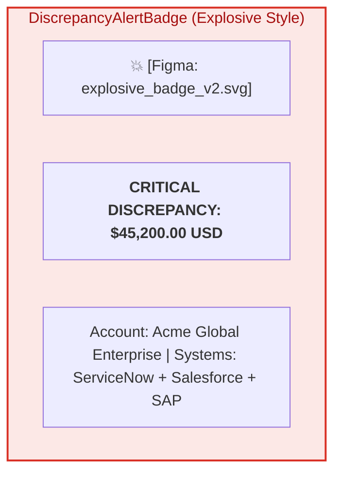

# A2UI Custom Component Catalog & Advanced Styling Architecture

- **Protocol Version**: A2UI (Agent-to-UI) v0.8
- **Core Philosophy**: Enterprise Declarative UI Synthesis over Generic Chatbot Widgets
- **Target Surfaces**: Gemini Enterprise Web Workspace, Vertex AI Agent Engine UI, Custom Enterprise Portals
- **Design Tokens**: Material Design 3 Extended Semantic Token System + Custom Figma Brand Kit

---

## 1. Why Custom A2UI? Moving Beyond Generic Chatbot Widgets

### 1.1. The Enterprise Widget Gap
Default conversational UI toolkits in modern LLM platforms generally provide only rudimentary building blocks:
- Plain markdown text and tables.
- Generic rectangular confirmation buttons ("Yes" / "No").
- Unstyled bullet lists with no layout intelligence.

For high-stakes enterprise workflows—such as **Data Reconciliation across ServiceNow, Salesforce, and SAP**—these default widgets completely fall apart:
1. **Lack of Multi-Dimensional Delta Visualization**: A tabular text markdown dump cannot clearly highlight which specific field has diverged, why the discrepancy occurred, or what the financial variance magnitude is.
2. **Missing Safety & Cryptographic Context**: Generic buttons fail to convey that an action is a high-stakes, irreversible ERP write mutation backed by a cryptographic audit signature.
3. **No Dynamic Visual Urgency**: Enterprise operators need instantaneous visual hierarchy (e.g. explosive variance badges for high-value financial drift vs subtle muted pills for minor SLA discrepancies).

### 1.2. The Custom A2UI Solution
The Data Reconciliation Agent emits declarative **A2UI v0.8 JSON payloads** interpreted by a custom frontend renderer. Instead of generating raw HTML/CSS, the agent returns structured semantic component schemas that render pixel-perfect, accessible, and theme-compliant UI cards.

---

## 2. A2UI Design Token System & Semantic Color Palette

| Token Name | Hex Code | Semantic Role |
| :--- | :--- | :--- |
| `--recon-brand-primary` | `#1A73E8` | Primary agent accent, active tabs, standard action buttons. |
| `--recon-brand-surface` | `#E8F0FE` | Soft blue container background for interactive review cards. |
| `--recon-variance-explosive` | `#D93025` | **Explosive Alert Badge** background for critical financial discrepancies (> $10,000). |
| `--recon-variance-pulsing` | `#FCE8E6` | Pulsing aura container for urgent discrepancy items. |
| `--recon-warning-amber` | `#F9AB00` | Warning border for unconfirmed SLA breaches / minor drift. |
| `--recon-warning-surface` | `#FEF7E0` | Yellow surface highlight for contested field-level cells. |
| `--recon-success-green` | `#188038` | Cryptographically signed approval stamp & reconciled status. |
| `--recon-success-surface` | `#E6F4EA` | Green confirmation card background. |
| `--recon-border-subtle` | `#DADCE0` | Clean structural dividing borders. |
| `--recon-text-primary` | `#202124` | Primary high-contrast typography. |
| `--recon-text-secondary` | `#5F6368` | Metadata timestamps, system tags, and UUID captions. |

---

## 3. Custom A2UI Catalog Specification

### 3.1. `DiscrepancyAlertBadge` (Explosive Variance Widget)
Highlights critical anomalies with an explosive visual callout, severity tag, and financial drift indicator.

```json
{
  "type": "a2ui.card.discrepancy_alert",
  "version": "0.8.0",
  "properties": {
    "badge_variant": "explosive_urgent",
    "severity": "CRITICAL",
    "title": "Critical Billing Discrepancy Detected",
    "account_name": "Acme Global Enterprise (ACC-89102)",
    "variance_display": "$45,200.00 USD",
    "systems_involved": ["ServiceNow", "Salesforce", "SAP S/4HANA"],
    "figma_asset_ref": "assets/figma/badges/explosive_badge_v2.svg",
    "custom_style": {
      "aura_pulse_animation": true,
      "border_color": "#D93025",
      "background_tint": "#FCE8E6"
    }
  }
}
```



---

### 3.2. `MultiSystemDiffTable` (Three-Way Side-by-Side Reconciliation)
Provides interactive side-by-side comparison across ServiceNow, Salesforce, and SAP OData records with field-level divergence highlights.

```json
{
  "type": "a2ui.widget.multi_system_diff",
  "version": "0.8.0",
  "properties": {
    "correlation_id": "RECON-2026-0816-092",
    "columns": [
      { "id": "field_name", "title": "Reconciled Field", "width": "25%" },
      { "id": "sn_val", "title": "ServiceNow (INC-88219)", "width": "25%", "system_icon": "servicenow" },
      { "id": "sf_val", "title": "Salesforce (CTR-4401)", "width": "25%", "system_icon": "salesforce" },
      { "id": "sap_val", "title": "SAP S/4HANA (INV-99042)", "width": "25%", "system_icon": "sap" }
    ],
    "rows": [
      {
        "field_name": "Billed Line Item Total",
        "sn_val": "$125,000.00",
        "sf_val": "$125,000.00",
        "sap_val": "$170,200.00",
        "has_mismatch": true,
        "divergent_column": "sap_val",
        "suggested_canonical_source": "Salesforce"
      },
      {
        "field_name": "SLA Service Credit Status",
        "sn_val": "APPROVED (5% Penalty)",
        "sf_val": "PENDING_CREDIT",
        "sap_val": "NOT_APPLIED",
        "has_mismatch": true,
        "divergent_column": "sap_val",
        "suggested_canonical_source": "ServiceNow"
      },
      {
        "field_name": "Payment Term",
        "sn_val": "Net 30",
        "sf_val": "Net 30",
        "sap_val": "Net 30",
        "has_mismatch": false
      }
    ]
  }
}
```

---

### 3.3. `FieldMatcherResolutionSelector` (Interactive Decision Form)
Empowers human operators to select canonical resolution actions directly from the chat card.

```json
{
  "type": "a2ui.form.resolution_selector",
  "version": "0.8.0",
  "properties": {
    "resolution_options": [
      {
        "id": "opt_credit_memo",
        "title": "Stage SAP Credit Memo ($45,200.00)",
        "subtitle": "Aligns SAP S/4HANA invoice to Salesforce Contract CTR-4401 and posts 5% SLA credit.",
        "impact_severity": "HIGH_MUTATION",
        "recommended": true
      },
      {
        "id": "opt_update_sf",
        "title": "Update Salesforce Contract Total to $170,200.00",
        "subtitle": "Accepts SAP billing figure as the approved amended contract value.",
        "impact_severity": "HIGH_MUTATION",
        "recommended": false
      },
      {
        "id": "opt_escalate",
        "title": "Escalate to Finance Controller (Manual Review)",
        "subtitle": "Leaves all systems untouched and creates a priority audit incident.",
        "impact_severity": "READ_ONLY",
        "recommended": false
      }
    ],
    "submit_action": {
      "target_endpoint": "/api/v1/recon/stage-mutation",
      "button_label": "Stage Selected Reconciliation",
      "style": "primary_brand"
    }
  }
}
```

---

### 3.4. `SignedMutationCard` (HITL Cryptographic Authorization Card)
Renders high-security cryptographic authorization stamps before executing ERP write actions.

```json
{
  "type": "a2ui.card.signed_mutation",
  "version": "0.8.0",
  "properties": {
    "mutation_id": "MUT-78921",
    "target_system": "SAP S/4HANA (Production)",
    "action_summary": "POST /sap/opu/odata4/CreditMemo (Amount: -$45,200.00 USD)",
    "cryptographic_stamp": {
      "algorithm": "HMAC-SHA256 / Ed25519",
      "signature_digest": "e3b0c44298fc1c149afbf4c8996fb92427ae41e4649b934ca495991b7852b855",
      "authorizer_identity": "secops-controller@enterprise.internal",
      "timestamp": "2026-08-16T23:00:00Z"
    },
    "confirmation_actions": [
      {
        "id": "btn_confirm",
        "label": "Execute Cryptographic Write",
        "style": "danger_verified",
        "requires_biometric_or_mfa": true
      },
      {
        "id": "btn_cancel",
        "label": "Abort Mutation",
        "style": "secondary_outline"
      }
    ]
  }
}
```

---

## 4. Figma Design Token & Asset Integration

To ensure cohesive design system collaboration across Engineering and Product Design:
- **Design Tokens Repository**: `assets/figma/tokens.json`
- **Figma Component Bridge**:
  - `figma:badge-explosive-v2` $\to$ Used in `DiscrepancyAlertBadge`
  - `figma:icon-connector-servicenow` $\to$ Brand header icon
  - `figma:icon-connector-salesforce` $\to$ Brand header icon
  - `figma:icon-connector-sap` $\to$ Brand header icon
  - `figma:stamp-hitl-verified` $\to$ Used in `SignedMutationCard`

> [!TIP]
> Designers can update `assets/figma/tokens.json` or replace SVG assets directly, and the A2UI rendering engine will automatically apply updated padding, corner radiuses, and drop-shadow elevations without requiring Go agent recompilation!
