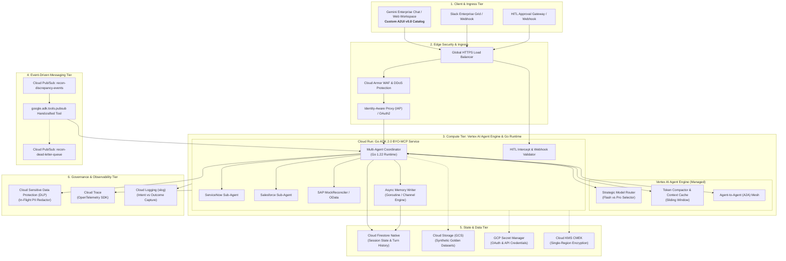
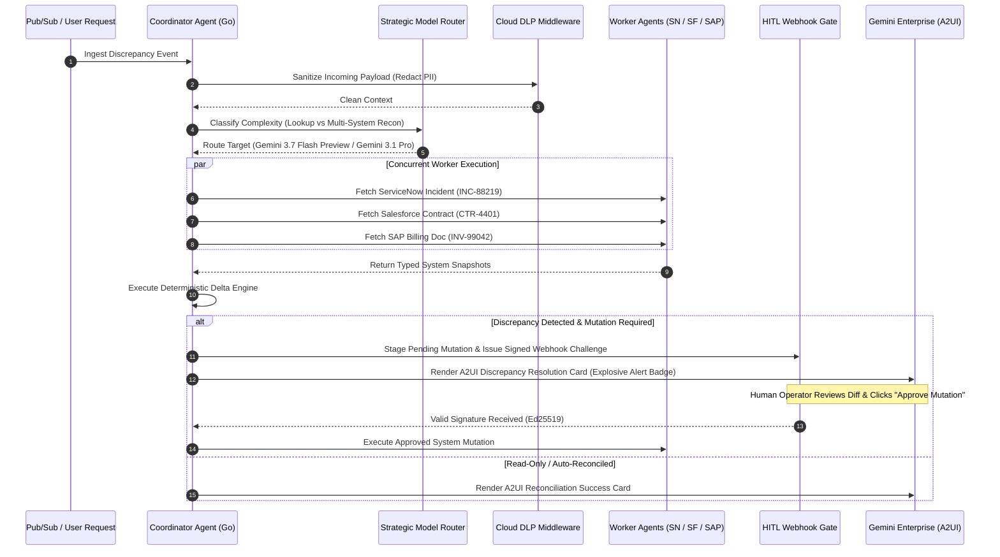

# Technical Design Document: Enterprise Data Reconciliation Agent Ecosystem

- **Document Version**: 1.0.0
- **Status**: APPROVED / IN PROGRESS
- **Core Runtime**: Go 1.22+ (ADK 2.0)
- **Primary Cloud Platform**: Google Cloud Platform (GCP)
- **AI Infrastructure**: Vertex AI Agent Engine, Gemini 3.7 Flash Preview / Gemini 3.1 Pro, Vertex AI Model Garden
- **A2UI Protocol**: Declarative Agent-to-UI (A2UI) v0.8 Custom Component Catalog

---

## 1. Executive Summary & Problem Statement

### 1.1. Business Context
Modern enterprise operations rely on multiple heterogeneous enterprise systems of record—primarily **ServiceNow** for IT service management and incident ticketing, **Salesforce** for customer relationship management and commercial contracts, and **SAP ERP (OData)** for financial billing and general ledger accounting. In real-world enterprise operations, discrepancies routinely arise between these systems:
- A customer is billed in SAP for services not recorded or delivered in Salesforce.
- A critical SLA ticket is resolved in ServiceNow without corresponding invoice reconciliation or service credits in Salesforce.
- Line items, contract IDs, currency rates, and cost centers drift due to human data-entry errors or desynchronized asynchronous batch jobs.

Historically, reconciling these discrepancies requires manual human swivel-chair investigation across three complex portals, averaging 45–90 minutes per contested record.

### 1.2. The Solution: Autonomous Data Reconciliation Agent
The **Data Reconciliation Agent** is an autonomous, high-throughput, multi-agent AI system built in **Go (ADK 2.0)** running on **Vertex AI Agent Engine** and **Cloud Run (BYO-MCP)**. It proactively ingests discrepancy events via **Cloud Pub/Sub**, orchestrates specialized sub-agents across ServiceNow, Salesforce, and SAP, verifies data integrity against enterprise schemas, scrubs PII in-flight via **Cloud DLP (Sensitive Data Protection)**, and presents rich, interactive resolution cards using a **custom A2UI catalog** inside the Gemini Enterprise workspace. High-stakes financial and customer-impacting mutations are strictly gated by **Human-in-the-Loop (HITL) cryptographic webhook signatures**.

### 1.3. Quantified Non-Functional Requirements (NFRs)
| Metric | Target SLA / Specification | Justification |
| :--- | :--- | :--- |
| **Simple Discrepancy Lookup Latency** | $\le 450\text{ ms}$ (p95) | Routed to Gemini 3.7 Flash Preview with Context Caching on Vertex AI. |
| **Multi-System Complex Reconciliation Latency** | $\le 2.8\text{ s}$ (p95) | Routed to Gemini 3.1 Pro via Coordinator-Worker parallel sub-agents. |
| **Throughput & Concurrency** | 2,500 reconciliations/min | Go native Goroutines/channels + Cloud Run auto-scaling. |
| **Agent Availability** | 99.95% uptime | Multi-zone Cloud Run + Vertex AI managed SLA. |
| **Data Redaction & DLP SLA** | 100% PII scrubbed before persistence | Go middleware integration with Cloud DLP inspection templates. |
| **HITL Mutation Safety** | Zero unauthorized mutations | Ed25519 / HMAC-SHA256 signed webhook authorization tokens. |

---

## 2. End-to-End System Topology & C4 Architecture

### 2.1. C4 Container Architecture Diagram



---

## 3. Core Architectural Subsystems

### 3.1. Go ADK 2.0 Runtime & Coordinator-Worker Multi-Agent Orchestration
Rather than executing a monolithic LLM prompt that attempts to reason across ServiceNow, Salesforce, and SAP simultaneously (which leads to severe context pollution, hallucinated tool calls, and high token costs), the system uses a **Coordinator-Worker Multi-Agent Pattern**:

1. **Coordinator Agent (`recon-coordinator`)**:
   - Analyzes incoming discrepancy events or user prompts.
   - Decomposes the task into specific lookup and verification sub-goals.
   - Evaluates complexity and triggers the **Strategic Model Router**.
   - Concurrently delegates sub-tasks to worker agents using Go goroutines and channels.
   - Aggregates worker outputs, calculates discrepancy deltas, and constructs the **A2UI Reconciliation Card**.

2. **ServiceNow Worker Agent (`sn-worker`)**:
   - Equipped with dedicated ServiceNow OpenAPI tool schemas (`get_ticket_details`, `search_incidents_by_account`, `append_work_notes`).
   - Validates SLA breach status, service incident timestamps, and affected CIs.

3. **Salesforce Worker Agent (`sf-worker`)**:
   - Equipped with Salesforce CRM tool schemas (`get_contract_line_items`, `get_billing_schedules`, `query_account_contracts`).
   - Handles account balance lookups and payment terms.

4. **SAP Worker / MockReconciler (`sap-worker`)**:
   - Implements the Go `MockReconciler` interface simulating enterprise SAP S/4HANA OData v4 endpoints (`/sap/opu/odata4/BillingDocument`, `/sap/opu/odata4/JournalEntry`).



---

### 3.2. Strategic Model Routing Engine
The agent utilizes a dynamic routing interface that balances **inference cost**, **turn latency**, and **reasoning depth**:

```go
type ModelTier string

const (
    ModelTierFlash ModelTier = "gemini-3.7-flash-preview"
    ModelTierPro   ModelTier = "gemini-3.1-pro"
)

type StrategicRouter interface {
    SelectModel(ctx context.Context, intent ReconIntent, contextTokens int) (ModelTier, error)
}
```

- **Gemini 3.7 Flash Preview**: Selected for single-system record lookups, schema field parsing, status checks, and simple work-note formatting. Turn latency $\le 450\text{ ms}$.
- **Gemini 3.1 Pro**: Selected for cross-system delta analysis, contract clause arbitration, billing discrepancy root-cause synthesis, and multi-turn A2A negotiation.

---

### 3.3. Token-Based Sliding Window Compaction & Persistent Memory
To manage multi-turn conversational history across extended reconciliation sessions without incurring token bloat or context degradation:

1. **Sliding Window Compaction**:
   - Retains full fidelity for the last $N=6$ interaction turns.
   - Older historical turns are periodically compacted into structured semantic summary cards using background LLM token compaction.
2. **Persistent Session State in Cloud Firestore**:
   - Each session is keyed by `session_id` (`/recon_sessions/{session_id}`).
   - Sub-collections store `/turns`, `/mutations`, and `/audit_logs`.
3. **Async Memory Operations**:
   - Long-term memory extraction, summary indexing, and embeddings generation are offloaded to background Go worker pools via buffered channels (`chan ReconMemoryEvent`), ensuring zero UI thread blocking.

---

### 3.4. Pub/Sub Toolset Integration (`google.adk.tools.pubsub`)
The agent integrates the experimental handcrafted `google.adk.tools.pubsub` toolset for high-throughput event consumption:
- **Base64 Payload Handling**: Built-in resilient decoding and binary payload serialization.
- **Pull/Ack Subscription Streaming**: Rich subscribe-side APIs supporting pull/ack/nack semantics with automatic dead-letter queue (DLQ) routing for poisoned payloads.

---

## 4. Custom A2UI (Agent-to-UI) Catalog & Advanced Styling

### 4.1. The Need for Custom A2UI over Generic Widgets
Standard chatbot responses in enterprise environments (plain text, markdown tables, or generic bot buttons) fail to convey the multi-dimensional complexity of financial and SLA data reconciliation. 

The Data Reconciliation Agent utilizes the **A2UI v0.8 Declarative Protocol** with a custom component catalog:

| Custom A2UI Component | Function | Visual Style & Figma Design Tokens |
| :--- | :--- | :--- |
| **`DiscrepancyAlertBadge`** | Highlights critical billing/SLA variances. | **Custom Explosive Badge** (`#EA4335` pulsing aura, `#FCE8E6` container, `figma:badge-explosive-v2`). |
| **`MultiSystemDiffTable`** | Compares ServiceNow vs Salesforce vs SAP side-by-side. | Three-column responsive grid with color-coded mismatch cells (`#FEF7E0` warning yellow, `#D93025` error red). |
| **`FieldMatcherSelector`** | Allows human reviewer to select winning field value. | Interactive radio card group with automated suggested resolution pill. |
| **`SignedMutationCard`** | Displays cryptographic signature and audit trail for HITL approval. | Security lock icon, cryptographic SHA-256 hash stamp, verified authorizer chip (`#188038`). |
| **`ReconProgressStepper`** | Visualizes live progress across multi-agent steps. | Horizontal animated stepper (`Pending` $\to$ `Ingested` $\to$ `Cross-Checked` $\to$ `Mutated`). |

---

## 5. Security, Privacy & Governance Architecture

### 5.1. In-Flight PII Redaction with Cloud DLP
All prompts, tool payloads, and logged outputs pass through a Go middleware integrating the **Google Cloud Sensitive Data Protection (DLP) API**:
- **Scanned InfoTypes**: `EMAIL_ADDRESS`, `US_SOCIAL_SECURITY_NUMBER`, `CREDIT_CARD_NUMBER`, `PHONE_NUMBER`, `IBAN_CODE`, `PERSON_NAME`.
- **Redaction Strategy**: In-memory token replacement with irreversible cryptographic masking (e.g., `[REDACTED_SSN_#9a2b]`) before writing to Firestore or emitting to Cloud Logging.

### 5.2. Cloud KMS & Secret Manager Integration
- **Secret Manager**: Securely injects OAuth credentials, ServiceNow instance tokens, Salesforce connected app certificates, and SAP client secrets at container startup. Zero hardcoded secrets.
- **Cloud KMS**: Single-region Customer-Managed Encryption Keys (CMEK) protect Firestore persistent storage, Cloud Storage golden datasets, and Pub/Sub event payloads.

### 5.3. Guided Error Handling Architecture
Instead of crashing or returning opaque stack traces to the LLM, all tools return typed Go errors adhering to the `GuidedError` contract:

```go
type GuidedError struct {
    ErrorCode        string            `json:"error_code"`
    Message          string            `json:"message"`
    FailedSystem     string            `json:"failed_system"`
    RecoveryAction   string            `json:"recovery_action"`
    SuggestedPayload map[string]any    `json:"suggested_retry_payload,omitempty"`
}
```
*Example LLM Recovery Feedback*: "Salesforce API returned 404 for Contract 'CTR-4401'. Recovery action: Execute tool 'search_contracts_by_account_name' with Account 'Acme Global' before retrying get_contract_line_items."

---

## 6. Observability & Tracing Framework

### 6.1. Structured JSON Logging with `slog`
Logs are emitted via Go 1.21+ `log/slog` adhering to Google Cloud Logging JSON schema:
- Includes `logging.googleapis.com/trace` and `logging.googleapis.com/spanId` extracted from W3C TraceContext.
- Explicit severity levels (`DEBUG`, `INFO`, `WARN`, `ERROR`).

### 6.2. Intent vs. Outcome Logger Decorator
Every tool call executes inside an Intent vs. Outcome decorator:
- **Intent**: Records the LLM's target parameters, rationale, and pre-execution state.
- **Outcome**: Records execution duration, HTTP status code, returned entity IDs, and error recovery prompts.

### 6.3. OpenTelemetry & Cloud Trace
- W3C `traceparent` headers are propagated across all sub-agent boundaries, Cloud Run containers, and outbound REST/OData connector calls.

---

## 7. Testing & Verification Framework

- **Golden Dataset**: Synthetic enterprise datasets in Cloud Storage (`gs://recon-golden-datasets/v1/`) containing 500+ parameterized reconciliation edge cases.
- **Automated Regression Suite**: Go test runner (`go test -v ./tests/...`) and prompt evaluation harness validating:
  1. Tool Schema Validation Accuracy (100% adherence to JSON schemas).
  2. Multi-Agent Routing Accuracy ($\ge 98.5\%$).
  3. PII Redaction Completeness ($100\%$).
  4. HITL Intercept Enforcement ($100\%$ mutations gated).
