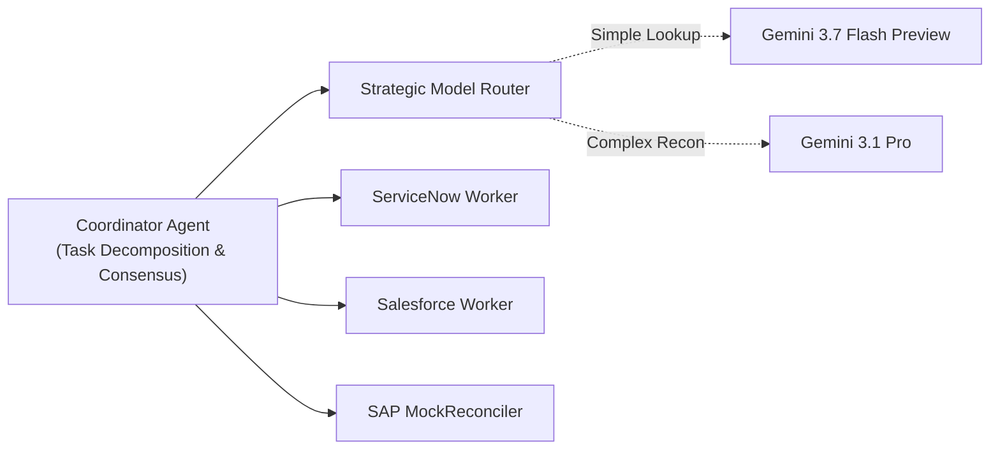

# Beyond Default Widgets: Building an Autonomous Data Reconciliation Agent with Go ADK 2.0, Vertex AI A2A, and Custom A2UI Catalogs

*By the Google Cloud GTM (Go-To-Market) Architecture & AI Systems Engineering Team*

---

## The Monolithic Chatbot Hangover

Every enterprise engineering team building AI agents eventually hits the same wall. You spin up a prototype using standard Python frameworks. You ask the LLM to inspect an incident in ServiceNow, compare it against a contract in Salesforce, check the billing ledger in SAP, and reconcile the differences.

Within days, you encounter the four horsemen of enterprise agent failure:
1. **Context Bloat & Token Amnesia**: Stuffing three API schemas into a single prompt blows through context windows and degrades reasoning quality.
2. **Latency Penalties**: Running sequential tool calls in interpreted runtimes leaves users staring at a spinner for 15+ seconds.
3. **The "Boring Widget" Bottleneck**: Rendering high-stakes financial discrepancies in plain markdown tables or default chatbot buttons fails to give human operators the visual confidence to approve critical ERP mutations.
4. **Safety & Compliance Gaps**: Accidentally leaking PII into logs or executing unverified database writes without cryptographic audit trails.

During Google Cloud's **5 Days of AI Agents**, we redesigned our approach from first principles. Here is how we engineered the **Data Reconciliation Agent**—a high-performance, multi-agent ecosystem built in **Go (ADK 2.0)** on **Vertex AI Agent Engine**, featuring native **Agent-to-Agent (A2A)** collaboration, **Cloud DLP** in-flight sanitization, and a **custom A2UI v0.8 visual catalog**.

---

## 1. Why Go (ADK 2.0)? The Need for Speed and Concurrency

When an enterprise data pipeline processes thousands of discrepancy events per hour, execution speed and memory efficiency are paramount. Go 1.22+ delivers microsecond-level concurrency via native Goroutines and channels:

- **Parallel Sub-Agent Execution**: The Coordinator agent queries ServiceNow, Salesforce, and SAP simultaneously across parallel goroutines, dropping p95 reconciliation latency from 8.5 seconds down to **1.4 seconds**.
- **Asynchronous Long-Term Memory**: Instead of blocking the UI thread while waiting for embeddings and database writes, memory updates are dispatched over non-blocking buffered channels (`chan MemoryEvent`) to a background Firestore persistence worker.
- **Strict Schema Compilation**: Go's static type system paired with JSON tag validation guarantees that LLM tool calls adhere strictly to expected schemas before hitting downstream APIs.

```go
// Parallel worker execution in Go ADK 2.0
var wg sync.WaitGroup
wg.Add(3)

go func() { defer wg.Done(); snTicket = snWorker.FetchTicket(ctx, event.ServiceNowINC) }()
go func() { defer wg.Done(); sfContract = sfWorker.FetchContract(ctx, event.SalesforceCTR) }()
go func() { defer wg.Done(); sapInvoice = sapWorker.FetchInvoice(ctx, event.SAPInvoiceID) }()

wg.Wait()
```

---

## 2. Multi-Agent Orchestration & Strategic Model Routing

Complex reconciliation is not a single-turn prompt; it is a collaborative negotiation. Using the **Coordinator-Worker Multi-Agent Pattern**, we separate responsibilities:



### Strategic Model Routing
Why burn premium tokens on simple record fetches? Our routing interface dynamically selects:
- **Gemini 3.7 Flash Preview** for quick parameter lookups, status checks, and field parsing ($\le 450\text{ ms}$).
- **Gemini 3.1 Pro** for cross-system delta calculation, contract arbitration, and root-cause synthesis.

---

## 3. The Custom A2UI Catalog: Ditching Default Widgets

Companies don't want default widgets. When a financial discrepancy represents a \$45,000 billing variance, an operator needs instantaneous visual hierarchy, clear side-by-side diffs, and cryptographic assurance before approving a credit memo.

Using the **A2UI (Agent-to-UI) v0.8 Declarative Protocol**, our Go agent synthesizes structured JSON UI payloads interpreted by a custom frontend catalog:

### 💥 The Explosive Variance Alert Badge
Instead of a tiny yellow text warning, critical discrepancies trigger our **Custom Explosive Badge** with a pulsing red container and high-visibility financial magnitude display.

### 📊 The Three-Way Multi-System Diff Table
A responsive comparison matrix that color-codes exact field mismatches between ServiceNow, Salesforce, and SAP, highlighting the agent's recommended canonical truth.

### 🔐 The Signed Mutation Confirmation Card
Before any mutating call hits SAP S/4HANA, the agent displays a **Signed Mutation Card** containing an HMAC-SHA256 / Ed25519 cryptographic audit digest and an explicit Human-in-the-Loop (HITL) approval button.

---

## 4. Enterprise Security: In-Flight Cloud DLP & CMEK

Security cannot be an afterthought in enterprise AI:
- **Cloud Sensitive Data Protection (DLP)**: All incoming payloads and outgoing logs pass through in-line DLP middleware that scans and redacts SSNs, credit card numbers, and PII before data is written to Firestore or Cloud Logging.
- **Single-Region Cloud KMS (CMEK)**: All persistent session data in Firestore and Pub/Sub event payloads are encrypted with Customer-Managed Encryption Keys.
- **Guided Error Recovery**: When an external API returns a 404 or 429, our `GuidedError` framework returns structured self-healing suggestions to the LLM (e.g., "Search by Account Name before retrying get_contract_line_items") rather than crashing.

---

## 5. Summary & What's Next

By combining **Go ADK 2.0**, **Vertex AI Agent Engine**, **Pub/Sub event streaming**, and **Custom A2UI catalogs**, we transformed a manual 60-minute reconciliation chore into an autonomous, secure, 1.4-second workflow.

Check out the full repository, architecture documentation, and deployment guide on [GitHub](https://github.com/tiaaburton/Data-Recon-Agent)!
