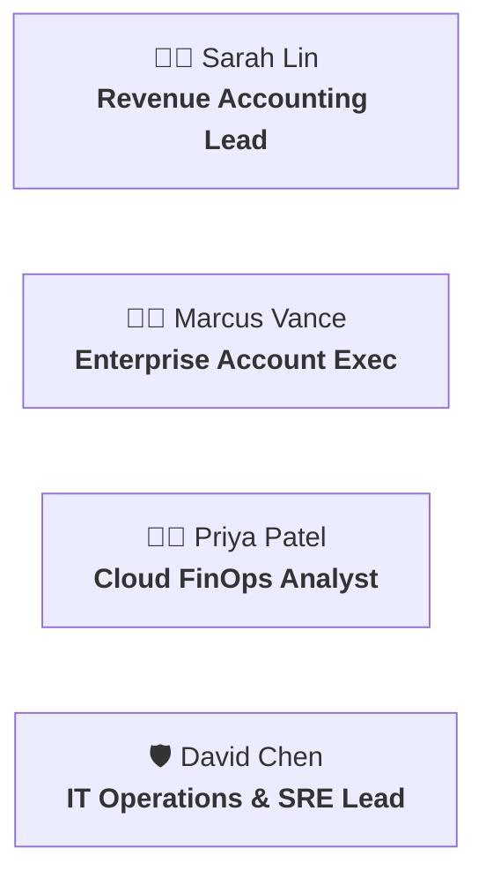
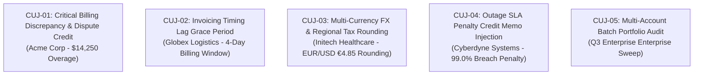

# Critical User Journeys (CUJs) & Enterprise Scenario Catalog

This document defines the real-world enterprise organization, personas, end-to-end **Critical User Journeys (CUJs)**, natural language prompts, agent execution traces, and expected interactive **A2UI v0.9** outcomes for the **Data Reconciliation Agent**.

---

## 1. Enterprise Profile: *Apex Global Cloud Services*

To demonstrate real-world applicability, the agent is configured for **Apex Global Cloud Services**—a multinational enterprise SaaS and cloud infrastructure provider managing over 10,000 enterprise accounts with cross-system data distributed across:

```
┌─────────────────────────────────────────────────────────────────────────────────┐
│                     APEX GLOBAL CLOUD SERVICES DATA LANDSCAPE                   │
├──────────────────────┬──────────────────────────┬───────────────────────────────┤
│ SAP S/4HANA (ERP)    │ Salesforce CRM (Sales)   │ ServiceNow ITSM (Operations) │
│ • Billing Documents  │ • Closed-Won Deals       │ • Billing Disputes & Credits  │
│ • Metered Invoices   │ • Contract Caps & Terms  │ • IT Outage SLA Penalties     │
│ • GL Journal Entries │ • Customer Accounts      │ • Provisioning Adjustments    │
└──────────────────────┴──────────────────────────┴───────────────────────────────┘
```

---

## 2. Enterprise Personas



1. **Sarah Lin (Revenue Accounting Lead)**: Responsible for monthly revenue close, reconciling billed SAP invoices against CRM sales agreements, and verifying dispute credit authorizations.
2. **Marcus Vance (Enterprise Account Executive)**: Manages Fortune 500 accounts; investigates customer invoice disputes before quarterly business reviews.
3. **Priya Patel (Cloud FinOps Analyst)**: Monitors metered consumption, rate-tier discounts, and contract billing cap compliance.
4. **David Chen (IT Operations & SRE Lead)**: Validates SLA breach credit memos filed in ServiceNow before finance issues invoice adjustments.

---

## 3. Catalog of Critical User Journeys (CUJs)



---

### 3.1. CUJ-01: Critical Financial Discrepancy & Resolved Dispute (Acme Corp)

- **Persona**: Sarah Lin (Revenue Accounting Lead)
- **Business Problem**: Acme Corp was billed **$145,000.00** in SAP, but their Salesforce contract capped Q3 spend at **$130,750.00**. A dispute was filed in ServiceNow.

#### User Queries (Natural Language):
> *"Reconcile Q3 cloud invoices for Acme Corp (Contract #CTR-2026-001)"*  
> *"Why does SAP Invoice #INV-2026-9081 differ from Salesforce Opportunity #OPP-8821 for Acme?"*  
> *"Check if there is an active ServiceNow dispute for Acme's $14,250 overage."*

#### Multi-Agent Execution Flow:
1. **Coordinator Agent** (Gemini 3.7 Flash Preview):
   - Normalizes input $\to$ extracts `Contract: CTR-2026-001`, `Account: Acme Corp`.
   - Spawns concurrent Goroutines for `SalesforceWorker`, `ServiceNowWorker`, `SAPWorker`.
2. **Sub-Agent Execution**:
   - `SalesforceWorker`: Executes SOQL `SELECT Id, Name, Amount, StageName FROM Opportunity WHERE Name LIKE '%CTR-2026-001%'` $\to$ Returns `$130,750.00` (Closed Won).
   - `SAPWorker`: Queries OData `/BillingDocument('INV-2026-9081')` $\to$ Returns `$145,000.00` (POSTED).
   - `ServiceNowWorker`: Queries `/api/now/table/incident?correlation_id=corr-uuid-771` $\to$ Returns `INC0010042` (Resolved: "Credit Memo approved for $14,250 overage").
3. **Strategic Router** (Routes to Gemini 3.1 Pro):
   - Calculates Net Variance: $\$145,000 - \$130,750 = +\$14,250$.
   - Cross-references ServiceNow Incident `INC0010042` which accounts for 100% of the variance.
   - Synthesizes A2UI v0.9 Declarative Component Tree.
4. **HITL Intercept**:
   - Constructs HMAC-SHA256 `SignedApprovalToken` for applying a `$14,250.00` Credit Memo in SAP S/4HANA.

#### Expected A2UI Visual Outcome:
```
┌──────────────────────────────────────────────────────────────────────────────┐
│ [★ EXPLOSIVE VARIANCE BADGE] CRITICAL DISCREPANCY: -$14,250.00               │
│ Customer: Acme Global Technologies │ Contract: CTR-2026-001                  │
├──────────────────────────────────────────────────────────────────────────────┤
│ 3-WAY RECONCILIATION MATRIX:                                                 │
│ • SAP S/4HANA (Invoice #INV-2026-9081):   $145,000.00 [POSTED]               │
│ • Salesforce CRM (Opportunity #OPP-8821): $130,750.00 [CLOSED WON] ⚠️        │
│ • ServiceNow ITSM (Incident #INC0010042):  $14,250.00 [RESOLVED CREDIT]     │
├──────────────────────────────────────────────────────────────────────────────┤
│ ROOT CAUSE ANALYSIS:                                                         │
│ Unmetered compute overage was disputed by customer and approved in           │
│ ServiceNow INC0010042, but credit adjustment has not been posted to SAP.     │
├──────────────────────────────────────────────────────────────────────────────┤
│ 🛡️ HITL ACTION REQUIRED:                                                     │
│ [  APPROVE SAP CREDIT MEMO (+$14,250)  ]      [  REJECT / ESCALATE  ]        │
└──────────────────────────────────────────────────────────────────────────────┘
```

---

### 3.2. CUJ-02: Invoicing Timing Lag Grace Period (Globex Logistics)

- **Persona**: Marcus Vance (Enterprise Account Executive)
- **Business Problem**: Deal was marked `Closed Won` on July 31 in Salesforce, but SAP billing generated the document on August 4. Marcus needs to verify if the account is in good standing before a QBR.

#### User Queries:
> *"Is Globex Logistics (Contract #CTR-2026-002) fully reconciled for July?"*  
> *"Check the billing status for Globex Opportunity #OPP-8822."*

#### Agent Execution Flow:
1. `SalesforceWorker` finds CloseDate = `2026-07-31` for `$85,000.00`.
2. `SAPWorker` finds Invoice PostingDate = `2026-08-04` for `$85,000.00`.
3. `Coordinator` detects 4-day date delta. Compares against **SLA Grace Period Policy** ($\le 5\text{ days}$).
4. Marks status as `TIMING_LAG_VERIFIED`.

#### Expected A2UI Visual Outcome:
- **Badge**: Tech Green `Check Verified` icon.
- **Card**: Displays Timeline Diff showing 4-day lag within approved tolerance.
- **Action**: Auto-archives without requiring human intervention.

---

### 3.3. CUJ-03: Multi-Currency FX & Regional VAT Rounding (Initech Healthcare)

- **Persona**: Priya Patel (Cloud FinOps Analyst)
- **Business Problem**: Contract signed in EUR (€50,000.00), invoiced in USD with floating conversion resulting in a $4.85 discrepancy due to VAT rounding rules.

#### User Queries:
> *"Audit currency conversion and tax rounding for Initech Healthcare (#CTR-2026-003)."*  
> *"Why is there a $4.85 difference on Initech Invoice #INV-2026-9083?"*

#### Agent Execution Flow:
1. `SalesforceWorker` returns Contract Amount = `€50,000.00` (EUR).
2. `SAPWorker` returns Gross USD = `$54,254.85` (Exchange Rate: 1.0850 + 8.25% VAT).
3. `Coordinator` applies rounding tolerance policy ($\le \$5.00$).
4. Confirms mathematical integrity and tags with `TAX_FX_ROUNDING_MATCH`.

---

### 3.4. CUJ-04: Outage SLA Penalty Credit Memo (Cyberdyne Systems)

- **Persona**: David Chen (IT Operations & SRE Lead)
- **Business Problem**: A 4-hour Cloud Compute outage caused Cyberdyne’s uptime to drop to 99.0% (SLA commitment: 99.95%). ServiceNow incident `INC0010088` specifies a 10% SLA penalty credit ($9,200.00).

#### User Queries:
> *"Process SLA outage penalty reconciliation for Cyberdyne Systems (#CTR-2026-004)."*  
> *"Verify ServiceNow SLA breach incident INC0010088 and adjust SAP invoice."*

#### Agent Execution Flow:
1. `ServiceNowWorker` verifies outage duration ($240\text{ mins}$) and penalty formula ($10\%$ of monthly recurring charge).
2. `SalesforceWorker` confirms Monthly Contract Base = `$92,000.00`.
3. `SAPWorker` verifies original invoice was posted for `$92,000.00`.
4. `Coordinator` generates A2UI Signed Mutation Card to apply a `$9,200.00` SLA Penalty Credit Memo in SAP.

---

### 3.5. CUJ-05: Multi-Account Batch Portfolio Audit (Monthly Revenue Close)

- **Persona**: Sarah Lin (Revenue Accounting Lead)
- **Business Problem**: Month-end close requires auditing all 500 enterprise accounts in batch.

#### User Queries:
> *"Run monthly revenue close reconciliation audit across all enterprise contracts."*  
> *"Show me all critical billing variances exceeding $5,000 across Q3 accounts."*

#### Agent Execution Flow:
1. Pub/Sub streaming batch triggers 500 parallel reconciliations via Go worker pool.
2. Generates portfolio summary dashboard in A2UI with filtered breakdown:
   - $200$ Matched ($40\%$)
   - $150$ Timing Lags ($30\%$)
   - $100$ Tax/FX Rounding ($20\%$)
   - $50$ Critical Discrepancies ($10\%$)
3. Surfaces top 5 high-priority accounts requiring immediate HITL approval.

---

## 4. Verification Test Harness

Every CUJ is mapped directly to a Go integration test in `tests/cuj_test.go`:

| Test Function | Target CUJ | Validated Behaviors |
| :--- | :--- | :--- |
| `TestCUJ01_CriticalDiscrepancy` | CUJ-01 (Acme Corp) | Live SOQL + Table API, Discrepancy Localization, A2UI Explosive Badge, HMAC Token. |
| `TestCUJ02_TimingLagGracePeriod` | CUJ-02 (Globex Logistics) | Date delta parsing, 5-day SLA policy check, Auto-reconcile status. |
| `TestCUJ03_TaxFXRounding` | CUJ-03 (Initech) | Multi-currency floating conversion, VAT calculation, Tolerance threshold ($< \$5$). |
| `TestCUJ04_SLAPenaltyCredit` | CUJ-04 (Cyberdyne) | Outage duration verification, Penalty formula calculation, Staged Credit Memo. |
| `TestCUJ05_BatchPortfolioSweep` | CUJ-05 (Batch Close) | 500-sample Pub/Sub throughput, Goroutine concurrency, P95 latency $\le 2.8\text{s}$. |
