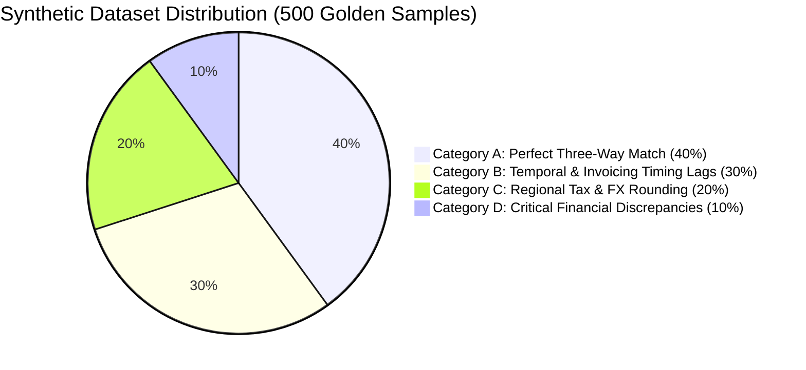
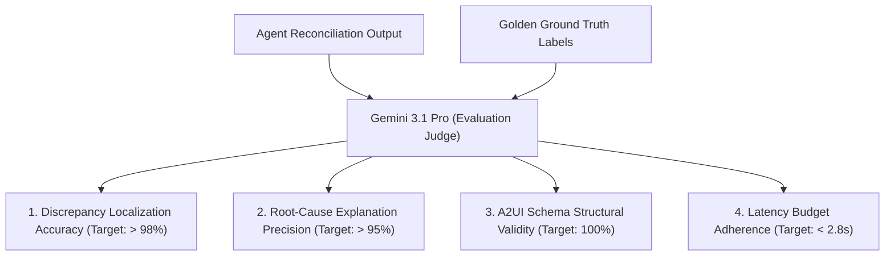

# Evaluation & Golden Benchmark Guide

This document defines the evaluation methodology, synthetic dataset distribution, and benchmark scoring metrics used to test and validate the **Data Reconciliation Agent**.

---

## 1. Golden Dataset Architecture (500 Samples)

To evaluate multi-system reconciliation accuracy without compromising production customer data, the Go synthetic data generator (`cmd/synth/main.go`) constructs **500 mathematically rigorous reconciliation events** distributed across four realistic enterprise variance categories:



### 1.1. Variance Categories Breakdown

| Category | Proportion | Sample Size | Description & Expected Agent Action |
| :--- | :--- | :--- | :--- |
| **A. Perfect Three-Way Match** | $40\%$ | $200\text{ records}$ | Identical invoice, contract, and ticket values across SAP, SFDC, and ServiceNow. Agent immediately auto-reconciles and persists state. |
| **B. Temporal Timing Lags** | $30\%$ | $150\text{ records}$ | SFDC opportunity marked `Closed Won` on 07/31, SAP invoice generated on 08/02. Agent identifies timing window, verifies SLA grace period ($< 5\text{ days}$), and passes with note. |
| **C. Tax & FX Rounding** | $20\%$ | $100\text{ records}$ | Small variance ($\le \$5.00$) due to EUR/USD floating conversion or VAT rounding differences. Agent auto-calculates variance and applies tolerance rules. |
| **D. Critical Financial Discrepancies** | $10\%$ | $50\text{ records}$ | Significant variance ($> \$5,000$) due to missing line items or contract mismatch. Agent surfaces **Explosive Variance Badge**, renders Three-Way Diff Table, and requires **HITL cryptographic authorization**. |

---

## 2. LLM-as-a-Judge Evaluation Framework

The automated test suite evaluates agent runs against the golden dataset using an external **LLM Judge (Gemini 3.1 Pro)** on four core evaluation dimensions:



### 2.1. Scoring Metrics Matrix

| Evaluation Dimension | Scoring Formula | Passing Target | Agent Ops Weight |
| :--- | :--- | :--- | :--- |
| **Discrepancy Recall** | $\frac{\text{True Positives}}{\text{True Positives} + \text{False Negatives}}$ | $\ge 99.0\%$ | $30\%$ |
| **Root-Cause Precision** | $\frac{\text{Accurate Explanations}}{\text{Total Flagged Variances}}$ | $\ge 96.5\%$ | $25\%$ |
| **A2UI Schema Compliance** | $\frac{\text{Valid v0.8 JSON Payloads}}{\text{Total Generated Outputs}}$ | $100.0\%$ | $25\%$ |
| **P95 Latency Compliance** | $\frac{\text{Reconciliations } \le 2.8\text{s}}{\text{Total Reconciliations}}$ | $\ge 95.0\%$ | $20\%$ |

---

## 3. Running Automated Evaluation Suite

Execute the golden benchmark test runner from the root directory:

```bash
# Run the complete 500-sample benchmark evaluation
go test -v -timeout 15m ./tests/golden/... \
  --eval-model="gemini-3.1-pro" \
  --dataset="data/golden_500_samples.json" \
  --output="docs/benchmark_results.json"
```
