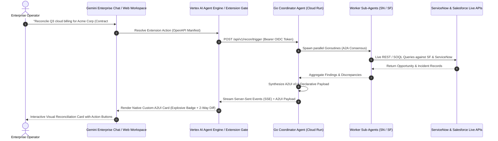
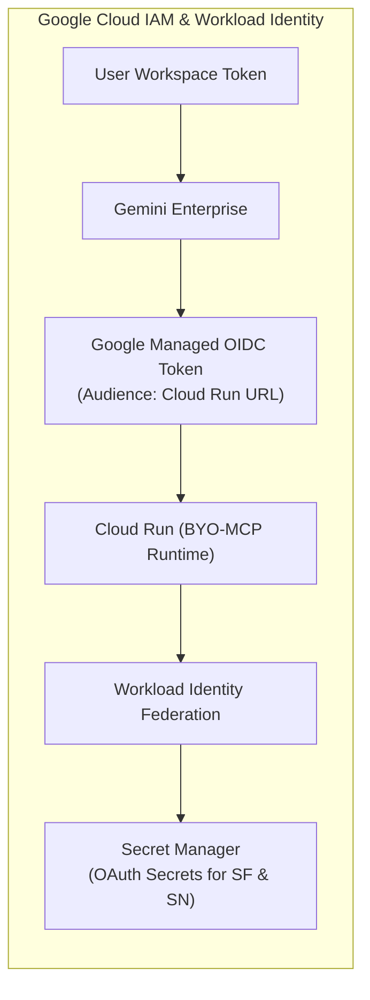

# Gemini Enterprise Integration & A2UI Extension Guide

This guide details the end-to-end integration architecture for connecting the **Data Reconciliation Agent** with **Gemini Enterprise (Gemini for Google Workspace, Gemini Enterprise Chat, and Vertex AI Agent Engine)**, including extension manifests, OpenAPI tool specifications, Workload Identity authentication, and streaming A2UI custom catalog rendering.

---

## 1. Integration Topology & Interaction Flow



---

## 2. Gemini Enterprise Extension Manifest (`gemini_extension.json`)

To register the Data Reconciliation Agent as a native extension in Gemini Enterprise, provide the following manifest configuration:

```json
{
  "name": "enterprise_data_reconciliation_agent",
  "display_name": "Autonomous Data Reconciliation Agent",
  "description": "Cross-system financial and billing reconciliation agent across Salesforce CRM and ServiceNow ITSM.",
  "version": "1.0.0",
  "auth": {
    "type": "OIDC_ID_TOKEN",
    "audience": "https://data-recon-agent-xxxx-uc.a.run.app",
    "authorization_url": "https://accounts.google.com/o/oauth2/v2/auth"
  },
  "api_spec": {
    "type": "OPENAPI_V3",
    "uri": "https://data-recon-agent-xxxx-uc.a.run.app/openapi.json"
  },
  "capabilities": {
    "streaming": true,
    "a2ui_renderer": {
      "version": "0.9",
      "custom_catalog_url": "https://data-recon-agent-xxxx-uc.a.run.app/assets/a2ui/catalog.json"
    }
  }
}
```

---

## 3. OpenAPI 3.0 Tool Specification (`openapi.json`)

Gemini Enterprise uses OpenAPI schemas to expose agent capabilities as natural language callable tools:

```yaml
openapi: 3.0.3
info:
  title: Enterprise Data Reconciliation Agent API
  version: 1.0.0
  description: High-performance Go ADK 2.0 reconciliation and dispute resolution engine.
servers:
  - url: https://data-recon-agent-xxxx-uc.a.run.app
paths:
  /api/v1/recon/trigger:
    post:
      summary: Trigger Cross-System Reconciliation
      description: Initiates parallel multi-agent data reconciliation across Salesforce Revenue Cloud and ServiceNow ITSM.
      operationId: triggerReconciliation
      requestBody:
        required: true
        content:
          application/json:
            schema:
              type: object
              required:
                - correlation_id
                - contract_id
              properties:
                correlation_id:
                  type: string
                  example: "corr-uuid-771"
                contract_id:
                  type: string
                  example: "CTR-2026-001"
                billing_record_id:
                  type: string
                  example: "BIL-2026-9081"
                tolerance_usd:
                  type: number
                  default: 5.00
      responses:
        '200':
          description: Reconciliation Completed with A2UI Payload
          content:
            text/event-stream:
              schema:
                type: string
                description: SSE stream delivering progressive thoughts, tool calls, and final A2UI JSON.
            application/json:
              schema:
                $ref: '#/components/schemas/ReconciliationResponse'

components:
  schemas:
    ReconciliationResponse:
      type: object
      required:
        - status
        - summary
        - a2ui_payload
      properties:
        status:
          type: string
          enum: [MATCHED, VARIANCE_DETECTED, CRITICAL_DISCREPANCY, TIMING_LAG]
        summary:
          type: string
        variance_usd:
          type: number
        a2ui_payload:
          type: object
          description: A2UI v0.9 Declarative Component Tree (Diff Matrix, Explosive Badges, Signed Action Cards)
```

---

## 4. Authentication & IAM Security Model



1. **Inbound Calls (Gemini $\to$ Cloud Run)**:
   - Gemini Enterprise obtains a short-lived Google OIDC ID token with `audience = https://data-recon-agent-xxxx-uc.a.run.app`.
   - The Go runtime validates the token via `google.golang.org/api/idtoken` before processing the request.
2. **Outbound Calls (Cloud Run $\to$ Systems of Record)**:
   - The Go runtime leverages GCP Service Account Workload Identity to fetch encrypted ServiceNow OAuth credentials and Salesforce Connected App private keys from GCP Secret Manager with single-region CMEK protection.

---

## 5. Streaming A2UI Component Rendering in Gemini Chat

When the Go Coordinator completes multi-agent reconciliation, it emits standard Server-Sent Events (SSE) to deliver the progressive stream:

```http
HTTP/1.1 200 OK
Content-Type: text/event-stream
Cache-Control: no-cache
Connection: keep-alive

event: agent_thought
data: {"step": "QUERY_SALESFORCE", "detail": "Retrieved Closed-Won Opportunity #OPP-8821 ($130,750.00)"}

event: agent_thought
data: {"step": "QUERY_SERVICENOW", "detail": "Retrieved Dispute Incident #INC-4412 (Billing Overage $14,250.00)"}

event: a2ui_render
data: {
  "version": "v0.9",
  "root": {
    "component": "ReconciliationCard",
    "properties": {
      "title": "Critical Financial Variance: -$14,250.00",
      "severity": "CRITICAL",
      "badge": {
        "type": "custom:ExplosiveVarianceBadge",
        "icon_url": "/assets/figma/badges/explosive_badge_v2.svg",
        "pulse_animation": true
      },
      "diff_matrix": {
        "type": "custom:MultiSystemDiffTable",
        "columns": ["Field", "Salesforce CRM", "ServiceNow ITSM"],
        "rows": [
          {"field": "Gross Billed Amount", "sfdc": "$145,000.00 ⚠️", "sn": "$145,000.00"},
          {"field": "Agreed Contract Cap", "sfdc": "$130,750.00", "sn": "N/A"},
          {"field": "Dispute Credit Status", "sfdc": "PENDING_CREDIT", "sn": "RESOLVED (#INC-4412)"}
        ]
      },
      "hitl_action": {
        "type": "custom:SignedMutationCard",
        "action_name": "Apply Salesforce Billing Adjustment",
        "approval_token": "eyJhbGciOiJFZERTQSI...",
        "webhook_url": "/api/v1/hitl/execute"
      }
    }
  }
}
```
