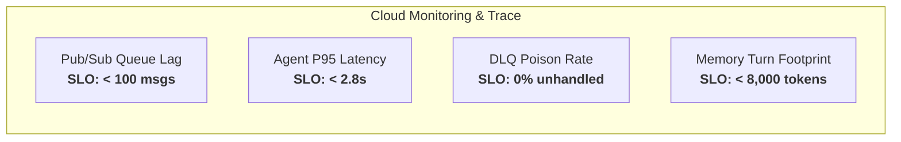

# Operations & Day-2 Support Runbook

This runbook provides Cloud Site Reliability Engineers (SREs), DevOps engineers, and Operations teams with standard operating procedures (SOPs) for maintaining, monitoring, and troubleshooting the **Enterprise Data Reconciliation Agent Ecosystem**.

---

## 1. System Health Indicators & SLIs/SLOs



| Metric Name | Target SLO | Alerting Threshold | Resolution Procedure |
| :--- | :--- | :--- | :--- |
| `recon_agent/reconciliation_latency_p95` | $\le 2.8\text{ s}$ | $> 3.5\text{ s}$ for $5\text{ mins}$ | Inspect Gemini API quota or slow connector response. |
| `recon_agent/pubsub_subscription_lag` | $\le 50\text{ msgs}$ | $> 250\text{ msgs}$ for $3\text{ mins}$ | Scale out Cloud Run maximum container instances. |
| `recon_agent/dlq_dead_letter_count` | $0\text{ msgs}$ | $> 1\text{ msg}$ immediate | Triage poison message in DLQ and inspect schema parser. |
| `recon_agent/hitl_token_expiration_rate` | $\le 2\%$ | $> 10\%$ for $15\text{ mins}$ | Notify operations team of pending approval backlog. |

---

## 2. Dead-Letter Queue (DLQ) Triage & Replay Procedure

When a corrupted, unparseable, or poison payload is received by the Pub/Sub toolset, the agent acknowledges the message from the main queue and routes it to `recon-dlq` with detailed failure attributes.

### 2.1. Inspecting DLQ Messages via `gcloud`

```bash
# Pull 5 poison messages from the DLQ subscription without auto-acking
gcloud pubsub subscriptions pull recon-dlq-sub \
  --limit=5 \
  --auto-ack=false \
  --project="${GCP_PROJECT_ID}"
```

### 2.2. Replaying Poison Messages after Bug Fix

Once the underlying schema bug or connector format is fixed:

```bash
# Replay DLQ messages back to the primary reconciliation topic
go run cmd/ops/dlq_replay.go \
  --source-subscription="projects/${GCP_PROJECT_ID}/subscriptions/recon-dlq-sub" \
  --target-topic="projects/${GCP_PROJECT_ID}/topics/recon-events" \
  --max-messages=100
```

---

## 3. Secret Rotation Procedure (Zero-Downtime)

To rotate 3P connector OAuth credentials or HITL HMAC keys stored in Secret Manager:

### 3.1. Rotate Secret in Secret Manager

```bash
# Add a new version to the existing secret
echo -n "new-client-secret-value-2026" | gcloud secrets versions add servicenow-oauth-secret \
  --data-file=- \
  --project="${GCP_PROJECT_ID}"
```

### 3.2. Cloud Run Graceful Auto-Reload

Cloud Run containers mounting secrets as volume files or environment variables with auto-refresh will pick up the new secret without requiring container redeployment. To trigger an immediate graceful rollover:

```bash
gcloud run services update data-recon-agent \
  --region=us-central1 \
  --update-env-vars="SECRET_ROTATION_EPOCH=$(date +%s)"
```

---

## 4. Connector Incident Response & Circuit Breaking

If ServiceNow or Salesforce undergoes planned maintenance or suffers an outage:

1. **Enable Connector Circuit Breaker**:
   ```bash
   # Set mock mode fallback via Cloud Run environment variable
   gcloud run services update data-recon-agent \
     --region=us-central1 \
     --update-env-vars="CONNECTOR_FALLBACK_MODE=ENABLED"
   ```
2. **Review Worker Health Logs**:
   ```bash
   gcloud logging read 'resource.type="cloud_run_revision" AND jsonPayload.worker="SFWorker"' \
     --limit=20 \
     --format=json
   ```
3. **Restore Live Connection**:
   ```bash
   gcloud run services update data-recon-agent \
     --region=us-central1 \
     --update-env-vars="CONNECTOR_FALLBACK_MODE=DISABLED"
   ```
