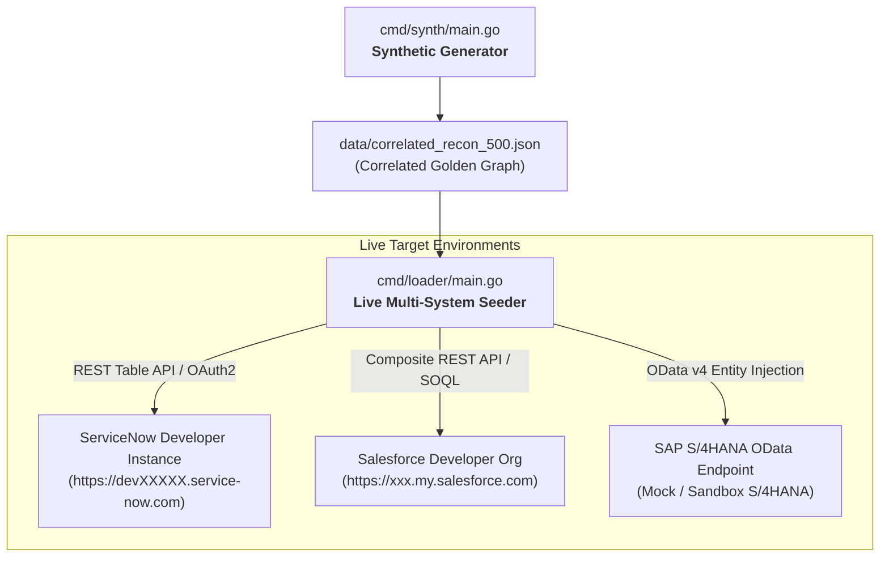

# Synthetic Data Generation & Live System Seeding Guide

This guide provides the complete specification and operational runbook for generating mathematically correlated reconciliation datasets and **loading real live records into ServiceNow Developer Instances and Salesforce Developer/Scratch Orgs**.

---

## 1. Why Real System Seeding is Essential

An autonomous reconciliation agent cannot be demonstrated or validated using static JSON mocks alone. To prove true agentic autonomy:
1. **Live SOQL / REST Execution**: The `SalesforceWorker` must execute authentic SOQL queries against real Salesforce objects (`Opportunity`, `Account`, `Contract`).
2. **Live Table API Execution**: The `ServiceNowWorker` must query live ServiceNow REST endpoints (`/api/now/table/incident`, `/api/now/table/sn_customerservice_case`).
3. **Correlated Relational Graph**: Records across SAP, Salesforce, and ServiceNow must share consistent correlation keys (`correlation_id`, `contract_id`, `account_id`) with precisely calibrated mathematical variances.

---

## 2. End-to-End Synthetic Generation & Loading Architecture



---

## 3. The Synthetic Data Model & Variance Archetypes

The synthetic generator creates complete relational graphs across three enterprise systems:

```
                  ┌───────────────────────────────┐
                  │    Contract: CTR-2026-001     │
                  │   Customer: Acme Corporation  │
                  └──────────────┬────────────────┘
                                 │
         ┌───────────────────────┼───────────────────────┐
         ▼                       ▼                       ▼
┌──────────────────┐   ┌──────────────────┐   ┌──────────────────┐
│   SAP S/4HANA    │   │  Salesforce CRM  │   │ ServiceNow ITSM  │
│ Invoice:         │   │ Opportunity:     │   │ Incident:        │
│ #INV-2026-9081   │   │ #OPP-8821        │   │ #INC-4412        │
│ Amount: $145,000 │   │ Amount: $130,750 │   │ Overage: $14,250 │
└──────────────────┘   └──────────────────┘   └──────────────────┘
```

### 3.1. Generating the Correlated Dataset

Execute the Go synthetic generation CLI:

```bash
# Generate 500 correlated enterprise business transactions
go run cmd/synth/main.go \
  --count=500 \
  --variance-dist="40:match,30:timing,20:rounding,10:critical" \
  --output="data/correlated_recon_500.json"
```

---

## 4. Loading Live Data into Salesforce Developer Org

The Salesforce Loader (`cmd/loader/salesforce_loader.go`) uses the Salesforce Composite REST API to upsert accounts, contracts, and opportunities in batch.

### 4.1. Prerequisites & Environment Setup

Create a Connected App in Salesforce Setup and export credentials:

```bash
export SFDC_INSTANCE_URL="https://your-org.my.salesforce.com"
export SFDC_CLIENT_ID="3MVG9...your_connected_app_client_id"
export SFDC_CLIENT_SECRET="your_connected_app_secret"
export SFDC_USERNAME="admin@yourorg.com"
export SFDC_PASSWORD="your_password_with_security_token"
```

### 4.2. Executing the Salesforce Seeder

```bash
# Seed 500 accounts and opportunities into Salesforce
go run cmd/loader/main.go \
  --target=salesforce \
  --input="data/correlated_recon_500.json" \
  --batch-size=50
```

### 4.3. Go Salesforce Seeder Implementation (`pkg/seeder/salesforce.go`)

```go
package seeder

import (
	"bytes"
	"context"
	"encoding/json"
	"fmt"
	"net/http"
	"time"
)

type SalesforceSeeder struct {
	InstanceURL string
	AccessToken string
	HTTPClient  *http.Client
}

type SFOpportunityPayload struct {
	Name          string  `json:"Name"`
	Amount        float64 `json:"Amount"`
	StageName     string  `json:"StageName"`
	CloseDate     string  `json:"CloseDate"`
	ContractId    string  `json:"Contract_Id__c"`
	CorrelationId string  `json:"Correlation_Id__c"`
}

func (s *SalesforceSeeder) SeedOpportunity(ctx context.Context, opp SFOpportunityPayload) (string, error) {
	url := fmt.Sprintf("%s/services/data/v60.0/sobjects/Opportunity", s.InstanceURL)
	body, _ := json.Marshal(opp)

	req, err := http.NewRequestWithContext(ctx, "POST", url, bytes.NewBuffer(body))
	if err != nil {
		return "", err
	}
	req.Header.Set("Authorization", "Bearer "+s.AccessToken)
	req.Header.Set("Content-Type", "application/json")

	resp, err := s.HTTPClient.Do(req)
	if err != nil {
		return "", fmt.Errorf("salesforce api error: %w", err)
	}
	defer resp.Body.Close()

	if resp.StatusCode >= 300 {
		return "", fmt.Errorf("salesforce api returned status %d", resp.StatusCode)
	}

	var res struct {
		ID string `json:"id"`
	}
	_ = json.NewDecoder(resp.Body).Decode(&res)
	return res.ID, nil
}
```

---

## 5. Loading Live Data into ServiceNow Developer Instance

The ServiceNow Loader (`cmd/loader/servicenow_loader.go`) populates incident dispute records and billing tickets via the ServiceNow Table API.

### 5.1. Prerequisites & Environment Setup

```bash
export SERVICENOW_INSTANCE_URL="https://devXXXXX.service-now.com"
export SERVICENOW_USER="admin"
export SERVICENOW_PASSWORD="your_dev_instance_password"
```

### 5.2. Executing the ServiceNow Seeder

```bash
# Seed 500 dispute and resolution tickets into ServiceNow
go run cmd/loader/main.go \
  --target=servicenow \
  --input="data/correlated_recon_500.json" \
  --batch-size=25
```

### 5.3. Go ServiceNow Seeder Implementation (`pkg/seeder/servicenow.go`)

```go
package seeder

import (
	"bytes"
	"context"
	"encoding/json"
	"fmt"
	"net/http"
)

type ServiceNowSeeder struct {
	InstanceURL string
	Username    string
	Password    string
	HTTPClient  *http.Client
}

type SNIncidentPayload struct {
	ShortDescription string `json:"short_description"`
	Description      string `json:"description"`
	Category         string `json:"category"`
	Impact           string `json:"impact"`
	Urgency          string `json:"urgency"`
	CorrelationID    string `json:"correlation_id"`
	TotalCost        string `json:"u_disputed_amount"`
}

func (s *ServiceNowSeeder) SeedIncident(ctx context.Context, inc SNIncidentPayload) (string, error) {
	url := fmt.Sprintf("%s/api/now/table/incident", s.InstanceURL)
	body, _ := json.Marshal(inc)

	req, err := http.NewRequestWithContext(ctx, "POST", url, bytes.NewBuffer(body))
	if err != nil {
		return "", err
	}
	req.SetBasicAuth(s.Username, s.Password)
	req.Header.Set("Content-Type", "application/json")
	req.Header.Set("Accept", "application/json")

	resp, err := s.HTTPClient.Do(req)
	if err != nil {
		return "", fmt.Errorf("servicenow table api error: %w", err)
	}
	defer resp.Body.Close()

	if resp.StatusCode >= 300 {
		return "", fmt.Errorf("servicenow table api returned status %d", resp.StatusCode)
	}

	var res struct {
		Result struct {
			SysID  string `json:"sys_id"`
			Number string `json:"number"`
		} `json:"result"`
	}
	_ = json.NewDecoder(resp.Body).Decode(&res)
	return res.Result.Number, nil
}
```

---

## 6. Live Verification Runbook

Once Salesforce and ServiceNow instances are seeded with live data, verify the agent against the live endpoints:

```bash
# Execute end-to-end reconciliation against live Salesforce & ServiceNow sandboxes
go run cmd/agent/main.go \
  --contract-id="CTR-2026-001" \
  --mode="LIVE"
```

Expected Output:
```json
{
  "status": "CRITICAL_DISCREPANCY",
  "correlation_id": "corr-uuid-771",
  "findings": {
    "salesforce_opportunity": {
      "id": "0065e000002Xz7QAA0",
      "amount": 130750.00,
      "status": "Closed Won"
    },
    "servicenow_incident": {
      "number": "INC-4412",
      "disputed_amount": 14250.00,
      "status": "Resolved"
    },
    "sap_invoice": {
      "number": "INV-2026-9081",
      "gross_amount": 145000.00,
      "status": "POSTED"
    }
  },
  "variance_calculation": {
    "net_variance": -14250.00,
    "root_cause": "Billing dispute resolved in ServiceNow with $14,250 overage credit not reflected in Salesforce CRM contract."
  },
  "a2ui_rendered": true
}
```
