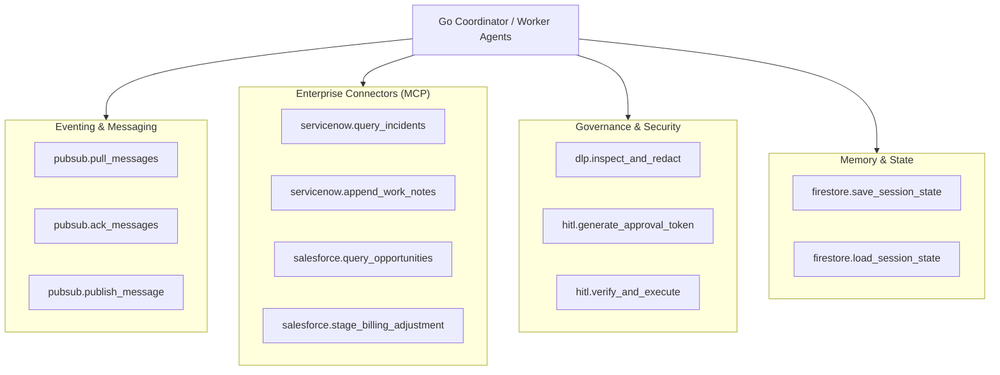

# ADK & MCP Tools Reference Manual

This reference manual documents the complete catalog of handcrafted ADK tools, third-party MCP connectors, DLP security filters, and HITL authorization primitives available to the **Coordinator** and **Worker Sub-Agents**.

---

## 1. Tool Catalog Overview



---

## 2. Pub/Sub Handcrafted Toolset (`google.adk.tools.pubsub`)

The Pub/Sub toolset is a specialized, handcrafted module designed for high-throughput reconciliation event ingestion, base64 payload decoding, and manual pull/ack flow control.

### 2.1. `pubsub.pull_messages`

Pulls a batch of raw discrepancy events from a designated Cloud Pub/Sub subscription.

- **Caller**: Go Ingestion Service / Coordinator Agent
- **Request Parameters**:
  ```json
  {
    "subscription": "projects/PROJECT_ID/subscriptions/recon-events-sub",
    "max_messages": 10,
    "return_immediately": false
  }
  ```
- **Response**:
  ```json
  {
    "messages": [
      {
        "message_id": "msg-88192301",
        "publish_time": "2026-08-16T22:00:00Z",
        "ack_id": "ack-token-99120",
        "attributes": {
          "source_system": "SALESFORCE_REVENUE",
          "correlation_id": "corr-uuid-771"
        },
        "data_base64": "eyJjb250cmFjdF9pZCI6IkNUUi0yMDI2LTAwMSIsImJpbGxlZF9hbW91bnQiOjE0NTAwMC4wMH0="
      }
    ]
  }
  ```

### 2.2. `pubsub.ack_messages`

Acknowledges successfully processed reconciliation messages to remove them from the queue.

- **Request Parameters**:
  ```json
  {
    "subscription": "projects/PROJECT_ID/subscriptions/recon-events-sub",
    "ack_ids": ["ack-token-99120"]
  }
  ```
- **Response**:
  ```json
  {
    "acknowledged_count": 1,
    "status": "SUCCESS"
  }
  ```

### 2.3. `pubsub.publish_message`

Publishes poison payloads to the Dead-Letter Queue (DLQ) or emits resolved reconciliation events to downstream telemetry topics.

- **Request Parameters**:
  ```json
  {
    "topic": "projects/PROJECT_ID/topics/recon-dlq",
    "data_json": {
      "error_code": "SCHEMA_VALIDATION_FAILURE",
      "raw_payload": "corrupted-non-json-bytes",
      "failed_at": "2026-08-16T22:05:00Z"
    },
    "attributes": {
      "severity": "CRITICAL",
      "retry_count": "3"
    }
  }
  ```

---

## 3. Systems of Record MCP Connectors

### 3.1. ServiceNow Worker Toolset (`servicenow.query_incidents` & `servicenow.append_work_notes`)

#### Query Incidents (`servicenow.query_incidents`)
Queries ServiceNow for IT service records, dispute tickets, or SLA breaches matching a correlation ID.

- **OAuth Scope**: `useraccount, incident.read`
- **Request Parameters**:
  ```json
  {
    "sysparm_query": "number=INC-4412^ORcorrelation_id=corr-uuid-771",
    "fields": ["number", "short_description", "state", "total_cost", "currency"]
  }
  ```
- **Response**:
  ```json
  {
    "result": [
      {
        "number": "INC-4412",
        "short_description": "Cloud Compute Over-provisioning Dispute",
        "state": "6",
        "state_display": "Resolved",
        "total_cost": "14250.00",
        "currency": "USD"
      }
    ]
  }
  ```

#### Append Work Notes (`servicenow.append_work_notes`)
Updates ServiceNow dispute records with automated reconciliation findings and resolution hashes.

---

### 3.2. Salesforce Worker Toolset (`salesforce.query_opportunities` & `salesforce.stage_billing_adjustment`)

#### Query Opportunities & Contracts (`salesforce.query_opportunities`)
Executes SOQL queries against Salesforce Connected App endpoints to retrieve CRM contracts, line items, and closed-won opportunity amounts.

- **OAuth Scope**: `api, refresh_token`
- **Request Parameters**:
  ```json
  {
    "soql": "SELECT Id, Name, Amount, StageName, CloseDate, Contract_Id__c FROM Opportunity WHERE Contract_Id__c = 'CTR-2026-001'"
  }
  ```
- **Response**:
  ```json
  {
    "totalSize": 1,
    "done": true,
    "records": [
      {
        "Id": "0065e000002Xz7QAA0",
        "Name": "Enterprise Cloud Architecture Agreement",
        "Amount": 130750.00,
        "StageName": "Closed Won",
        "CloseDate": "2026-07-31",
        "Contract_Id__c": "CTR-2026-001"
      }
    ]
  }
  ```

#### Stage Billing Adjustment (`salesforce.stage_billing_adjustment`)
> **Restricted**: Can only be executed with a valid, cryptographically verified `SignedApprovalToken`.

- **Request**:
  ```json
  {
    "contract_id": "CTR-2026-001",
    "adjustment_amount": 14250.00,
    "reason_code": "SERVICENOW_DISPUTE_CREDIT",
    "approval_token": "eyJhbGciOiJFZERTQSI..."
  }
  ```

---

## 4. Cloud DLP Security Primitives (`dlp.inspect_and_redact`)

Inspects and redacts sensitive PII (Social Security Numbers, Credit Cards, IBANs, Tax IDs, Names) before payloads are written to memory or persistent storage.

- **Request**:
  ```json
  {
    "text": "Customer contact Alice Smith (SSN: 999-12-3456) disputed billing record BIL-2026-9081.",
    "info_types": ["US_SOCIAL_SECURITY_NUMBER", "PERSON_NAME", "EMAIL_ADDRESS"]
  }
  ```
- **Response**:
  ```json
  {
    "redacted_text": "Customer contact [PERSON_NAME_1] (SSN: [REDACTED_SSN]) disputed billing record BIL-2026-9081.",
    "findings_count": 2,
    "execution_time_ms": 14
  }
  ```

---

## 5. HITL Cryptographic Authorization Tools

### 5.1. `hitl.generate_approval_token`

Constructs an Ed25519 / HMAC-SHA256 signed approval request token containing an immutable payload digest, user permissions, and a 5-minute TTL.

### 5.2. `hitl.verify_and_execute`

Verifies the cryptographic signature of the approval token, checks nonce replay prevention in Firestore, and triggers downstream write mutations.
